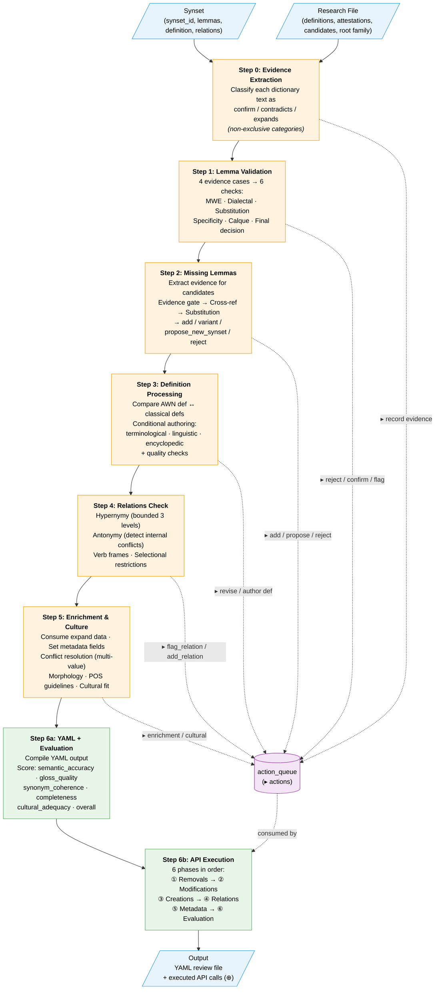
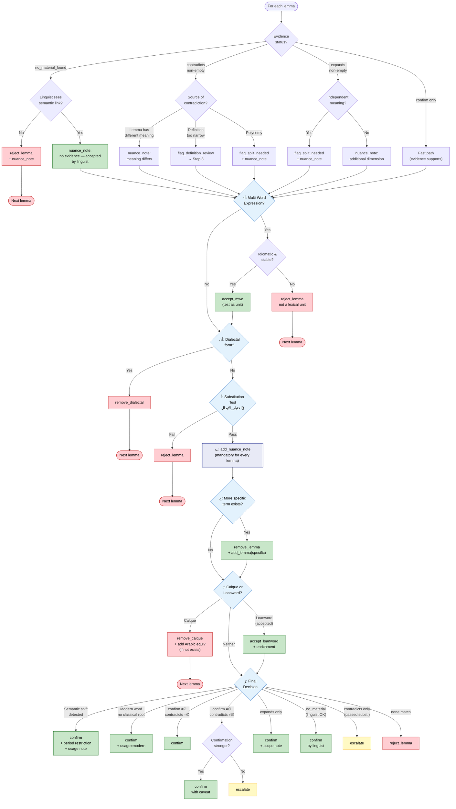

# Algorithm Diagrams — draft_api.md

Three Mermaid diagrams representing the linguistic review algorithm.
For the full pseudocode, see [draft_api.md](draft_api.md).

---

## Diagram 1: High-Level Pipeline

Steps 0–6 as a vertical pipeline. The `action_queue` accumulates decisions from Steps 0–5, then Step 6 executes them.

---

## Diagram 2: Step 1 — Lemma Validation Decision Tree

The most complex step: evidence-based gating → sequential checks → final decision.

---

## Diagram 3: API Execution Phases (Step 6b)

The action_queue is executed in 6 sequential phases. Each phase must complete before the next begins.

```mermaid
flowchart LR
    AQ[("action_queue\n(collected from\nSteps 0–5)")]

    subgraph P1["Phase 1: Removals"]
        P1_IN["reject_lemma\nremove_lemma\nremove_calque\nremove_dialectal"]
        P1_API["⊕ remove_sense()"]
        P1_IN --> P1_API
    end

    subgraph P2["Phase 2: Modifications"]
        P2A["modify_lemma_form\n→ ⊕ update_lemma()"]
        P2B["revise_definition\n→ ⊕ update_definition()"]
        P2C["flag_pos_mismatch\n→ ⊕ update_entry()\n   / update_synset()"]
    end

    subgraph P3["Phase 3: Creations"]
        P3A["add_lemma\n→ ⊕ create_entry()\n   + add_sense()"]
        P3B["add_variant_form\n→ ⊕ add_form()"]
        P3C["propose_new_synset\n→ ⊕ create_synset()\n   + create_entry()\n   + add_sense()\n   + add_synset_relation()\n   + add_definition()\n   + link_ili()"]
        P3D["flag_split_needed\n→ ⊕ create_synset()\n   + move_sense()\n   + add_synset_relation()"]
        P3E["author_definition\n→ ⊕ add_definition()"]
        P3F["add_phraset\n→ ⊕ create_entry()\n   + add_sense()"]
        P3G["add_example\n→ ⊕ add_synset_example()\n   / add_sense_example()"]
    end

    subgraph P4["Phase 4: Relations"]
        P4A["flag_relation\n→ ⊕ remove_synset_relation()\n   + add_synset_relation()"]
        P4B["link_broken_plural\n→ ⊕ add_sense_relation()"]
    end

    subgraph P5["Phase 5: Metadata"]
        P5A["add_enrichment\n→ ⊕ set_metadata(sense)"]
        P5B["add_nuance_note\n→ ⊕ set_metadata(sense, nuance)"]
        P5C["add_syntactic_frame\n→ ⊕ set_metadata(sense, frame)"]
        P5D["add_collocation\n→ ⊕ set_metadata(sense, colloc)"]
        P5E["correct_root\n→ ⊕ set_metadata(entry, root)"]
        P5F["accept_loanword\n→ ⊕ set_metadata(entry, etymology)"]
        P5G["cultural_fit\n→ ⊕ set_metadata(synset, cultural)"]
        P5H["escalate\n→ ⊕ set_metadata(synset, escalation)\n   + set_confidence(0.0)"]
    end

    subgraph P6["Phase 6: Evaluation"]
        P6A["Scores\n→ ⊕ set_metadata(synset)\nfor: semantic_accuracy\ngloss_quality\nsynonym_coherence\ncompleteness\ncultural_adequacy\noverall"]
        P6B["confirm\n→ ⊕ set_confidence(sense, 1.0)"]
        P6C["Overall confidence\n→ ⊕ set_confidence(synset)"]
    end

    OUT[/"YAML + API calls\ncompleted"/]

    AQ --> P1
    P1 -->|"removals done"| P2
    P2 -->|"modifications done"| P3
    P3 -->|"creations done"| P4
    P4 -->|"relations done"| P5
    P5 -->|"metadata done"| P6
    P6 --> OUT

    %% ── Styles ──
    classDef removal fill:#ffcdd2,stroke:#C62828,color:#000
    classDef modify fill:#fff9c4,stroke:#F9A825,color:#000
    classDef create fill:#c8e6c9,stroke:#2E7D32,color:#000
    classDef relation fill:#e3f2fd,stroke:#1565C0,color:#000
    classDef meta fill:#f3e5f5,stroke:#7B1FA2,color:#000
    classDef eval fill:#e0f2f1,stroke:#00695C,color:#000

    class P1 removal
    class P2 modify
    class P3 create
    class P4 relation
    class P5 meta
    class P6 eval
```

